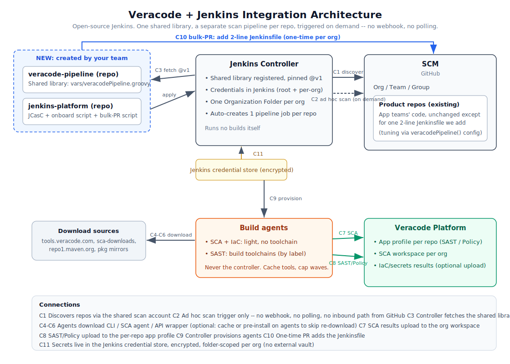

# Veracode + Jenkins Integration: Solution Document

Open-source Jenkins, many orgs. Veracode SCA, IaC/secrets, and SAST run automatically on every repo, without modifying or risking any team's existing build.

---

## 1. Summary

We add Veracode scanning as a separate pipeline that runs beside each team's build, triggered by the same Git events. All logic lives in one shared library; each repo gets a 2-line `Jenkinsfile` that calls it. Jenkins Organization Folders auto-discover every repo per org.

- **SCA** (dependencies) and **IaC/secrets**: every build, on the checked-out source. No build needed, so they cover every repo immediately.
- **SAST**: the repo's default branch only, after a merge (never on PRs). Needs a build, so it is phased in per org.
- **SCM auth**: a single read-only GitHub PAT (service account) lets Jenkins discover and check out repos across the orgs. This is the fast path for now; per-org GitHub Apps are a planned hardening step (see the note in section 4).


---

## 2. Architecture

<p align="center">
  
  <br>
  <em>Reference architecture for centralized Jenkins-managed Veracode scanning across GitHub organizations.</em>
</p>

Connection legend:
- **C1** Controller discovers repos/branches/PRs in each org (read), using the shared scan account.
- **C2** SCM webhook (push/PR) triggers indexing and builds.
- **C3** Controller fetches the shared library at build time.
- **C4-C6** Agents download the Veracode CLI, SCA agent, and Java API wrapper.
- **C7** SCA results upload to the org's Veracode workspace.
- **C8** SAST/Policy upload to the per-repo Veracode app profile.
- **C9** Controller dispatches builds to the static agents.
- **C10** One-time per org: PRs add the 2-line `Jenkinsfile` (separate from the controller).

---

## 3. What we create, and where

| # | New artifact | Location | Purpose |
|---|--------------|----------|---------|
| 1 | `veracode-pipeline` repo | New Git repo | Shared library `vars/veracodePipeline.groovy`, tagged `v1` |
| 2 | `jenkins-platform` repo | New Git repo | JCasC, the `veracode-onboard` script, bulk-PR script |
| 3 | Library registration | Jenkins controller | Points Jenkins at repo 1, default version `v1` |
| 4 | Root credentials | Jenkins controller (root) | `veracode-api-id`, `veracode-api-key`, `scm-readonly` |
| 5 | Org folder per org | Jenkins controller | Created by `veracode-onboard`; discovers and scans each org's repos |
| 6 | Per-org SCA token | Each org folder | `srcclr-api-token`, minted from Veracode and bound by `veracode-onboard` |
| 7 | 2-line `Jenkinsfile` | Each existing repo | Calls the library (added by PR) |
| 8 | App profiles + workspaces | Veracode platform | One profile per repo; one workspace per org |

Only repos 1 and 2 are new. Existing product repos change by one file each.

---

## 4. Requirements

**Jenkins plugins:** `workflow-cps-global-lib`, `workflow-aggregator`, `workflow-multibranch`, `pipeline-model-definition`, `cloudbees-folder`, `github-branch-source`, `credentials`, `credentials-binding`, `plain-credentials`, `configuration-as-code`, `ws-cleanup`, `timestamper`.
> The agents attach over SSH or JNLP, so the `kubernetes` plugin is not needed.

**Credentials:**

| ID | Type | Stored at | Used for |
|----|------|-----------|----------|
| `veracode-api-id` | Secret text | Jenkins root | SAST/Policy + IaC upload (HMAC) |
| `veracode-api-key` | Secret text | Jenkins root | same |
| `srcclr-api-token` | Secret text | each org folder | SCA upload to that org's workspace (minted + bound by `veracode-onboard`) |
| `scm-readonly` | Username + token | Jenkins root | GitHub org discovery + library fetch |

All of the above live in the Jenkins credential store (encrypted at rest with the controller key). No external secrets manager is used. The SCA token is folder-scoped per org; the others are root. The `veracode-onboard` script reads `veracode-api-id`/`veracode-api-key`, mints each org's Jenkins SCA token from the Veracode API, and writes the per-org `srcclr-api-token`; wherever it runs (controller or a small admin agent) needs egress to `api.veracode.com`.

**SCM permissions (GitHub PAT, service account):**
- *Scan account* (`scm-readonly`, in Jenkins): GitHub classic PAT with `repo` and `read:org`, plus `admin:org_hook` only if Jenkins auto-registers the org webhook (omit it and create the webhook manually otherwise). The account must be a member of each org it scans, and is reused to fetch the shared library.
- *Push token* (rollout script only, via `GITHUB_TOKEN`, not stored in Jenkins): GitHub PAT with `repo`.

> Planned hardening (revisit after go-live): replace the shared PAT with one GitHub App per org, stored folder-scoped, for per-org isolation, short-lived auto-rotated tokens, app-level webhooks (drops `admin:org_hook`), and no shared account or seat.

**Agents:** Use labels so SAST jobs land on agents that carry each language's build toolchain (SAST autopackaging compiles); SCA + IaC are light and can run on any agent. Throttle first-run indexing and roll out in waves so the org folders do not saturate the pool. Optional optimization (not required now): pre-cache the Veracode CLI, the SCA agent, and the Java API wrapper on the agents to cut egress and build time. The library already prefers an on-PATH `veracode` binary, so a cached install is picked up automatically; pin the Java wrapper to a cached jar instead of resolving the latest each run.

**Network egress from agents:** `tools.veracode.com`, `sca-downloads.veracode.com`, `repo1.maven.org`, your Veracode region API host (`api.veracode.com` / `analysiscenter.veracode.com`, or EU/Federal), your GitHub host (`github.com` or GitHub Enterprise), and the language package mirrors the SAST build resolves. The Veracode tool downloads (CLI, SCA agent, API wrapper) can be cached or pre-installed on the agents to avoid re-fetching every build (optional, see Agents).

**Inbound webhook (one per org):** GitHub `/github-webhook/` to the controller.

---

## 5. Rollout plan (in order)

### Phase 0: Pre-reqs (mostly done)
- Confirm the SAST worker pool carries each language's build toolchain (only open item).
- Have ready: Veracode API id/key + SCA token(s); a read-only GitHub scan PAT (`scm-readonly`) and a push token for the one-time rollout (scopes in section 4).

### Phase 1: Build the assets
1. Create `veracode-pipeline` repo, add `vars/veracodePipeline.groovy`, `git tag v1`.
2. Create `jenkins-platform` repo with the JCasC, the `veracode-onboard` script, and bulk-PR script.
3. Install the plugins (section 4) on the controller.
4. Stand up the  agents (label the SAST-capable ones); confirm egress.

### Phase 2: Wire Jenkins
5. Add root credentials `veracode-api-id`, `veracode-api-key`, `scm-readonly`. All in the Jenkins credential store. No per-org SCA token values are needed here; `veracode-onboard` mints them in Phase 3.
6. Register the shared library: Manage Jenkins → System → Global Pipeline Libraries → name `veracode-pipeline`, default version `v1`, allow override on, load implicitly off, retrieval Modern SCM with `scm-readonly`.

### Phase 3: Connect SCM
7. Run `veracode-onboard.groovy` as a trusted system script (Script Console, or an admin job with an "Execute system Groovy script" step). In one pass, for every org in `ORGS`, it creates the Organization Folder, mints that org's Jenkins SCA token from Veracode, and binds it as the folder credential `srcclr-api-token`. Needs egress to `api.veracode.com`.
8. Ensure each org has a webhook to the controller (auto via the scan account if its PAT has `admin:org_hook`, or create it manually).

### Phase 4: Deliver to repos
10. Per org, run the bulk-PR script (dry-run first), then merge:
    ```
    export GITHUB_TOKEN=...        # push token, repo + PR scope
    python3 bulk_add_jenkinsfile.py --org <ORG> --lib-version v1 --dry-run
    python3 bulk_add_jenkinsfile.py --org <ORG> --lib-version v1 --skip-archived --skip-forks
    ```
    The script is idempotent (skips repos that already have the file or branch).

### Phase 5: Pilot
11. Point one org at non-prod repos, pinned to `@veracode-pipeline@main` (canary).
12. Verify on a feature branch / PR: SCA + IaC run; no Package/SAST.
13. Verify on a default-branch merge: Package + SAST/Policy run; results in the platform; SCA in the right workspace; IaC JSON archived.
14. Run the declarative linter once against the 2-line Jenkinsfile on the controller.

### Phase 6: Roll out
15. Enable SCA + IaC across all orgs (immediate, no toolchain dependency).
16. Enable SAST org by org as the toolchains on the SAST pool are confirmed.
17. Promote all orgs from canary to the pinned `@v1`.

### Phase 7: Operate
- Ship library changes as new tags (`v2`), promote orgs in waves; clean rollback by re-pinning.
- Monitor org-folder scan health, agent saturation, and Veracode API throttling on first-run waves.
- Apply the auth hardening (env-var creds for the wrapper instead of `-vkey` on the command line).
- Because all secrets live in the Jenkins credential store, treat the controller as the secret custodian: restrict admin access, encrypt backups, protect `$JENKINS_HOME/secrets`, and keep SCA tokens folder-scoped per org.
- Rotate the shared scan PAT on a schedule; it is the one broad standing credential, which is the main reason to move to per-org GitHub Apps later.
- Watch saturation on first-run waves. Caching or pre-installing the Veracode tools (CLI, SCA agent, Java wrapper) on the agents is optional and avoids re-downloading them every build.

**Add a new org later:** add a line to the `ORGS` list in `veracode-onboard.groovy` and re-run it (creates the folder, mints the token, binds the credential), then run the bulk-PR script. The scan PAT must be a member of the new org. Nothing else.

---

## 6. Scan behavior (what runs, when)

| Trigger | SCA | IaC/secrets | SAST/Policy |
|---------|-----|-------------|-------------|
| PR / feature branch | yes | yes | no |
| Merge to default branch | yes | yes | yes |

- SCA and IaC/secrets are non-gating by default (report, do not fail the build).
- SAST runs only on the default branch, detected via `BRANCH_IS_PRIMARY`; a merge is a push to that branch with no change-request id, so PRs are always excluded.
- App profile per repo = `org/repo`; Veracode filters/groups via Git metadata. SCA results land in the per-org workspace selected by that org's token.

---

## 7. Why this is low-risk

- Runs as its own pipeline beside each team's build, never inside it, so it cannot break their builds.
- The only change to a product repo is one reviewed 2-line file, trivially reversible.
- Centrally versioned: pilot a change on one org, roll out in waves, roll back by re-pinning a tag.
- Standard open-source Jenkins. No commercial platform introduced.
- Secrets stay in the Jenkins credential store, encrypted at rest, with SCA tokens folder-scoped per org; no third-party secret service is introduced.
- For now SCM access uses one shared read-only PAT. It is read-only and reviewed, but it is a single broad credential, so moving to per-org GitHub Apps is the planned next step.
